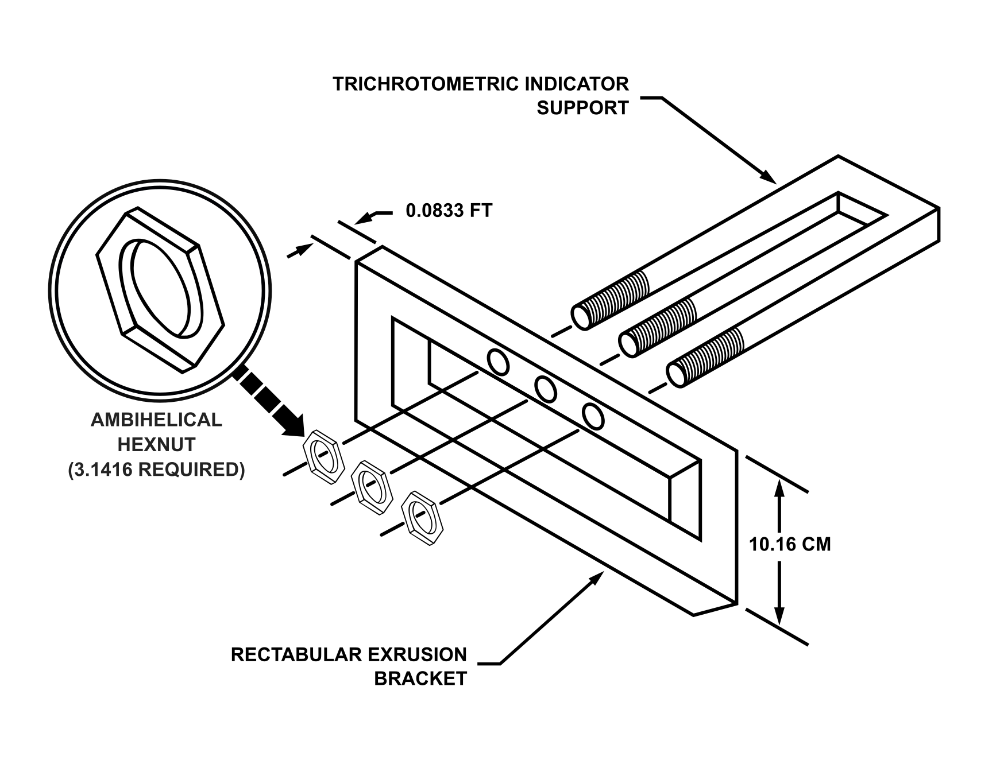
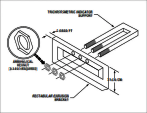
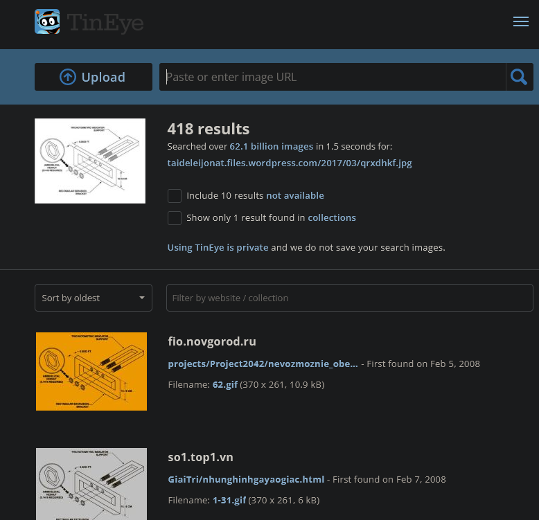
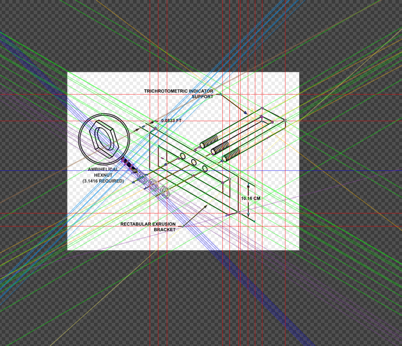
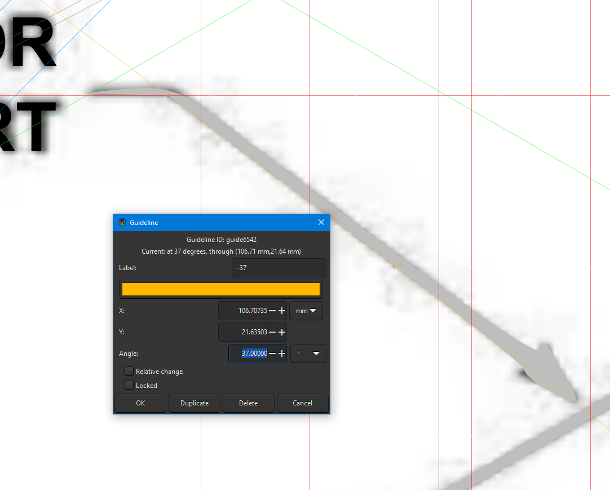
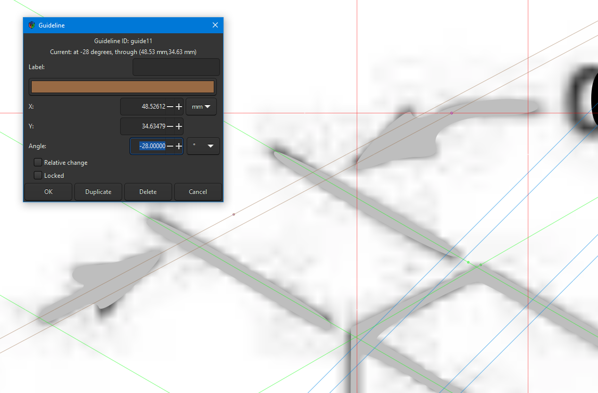
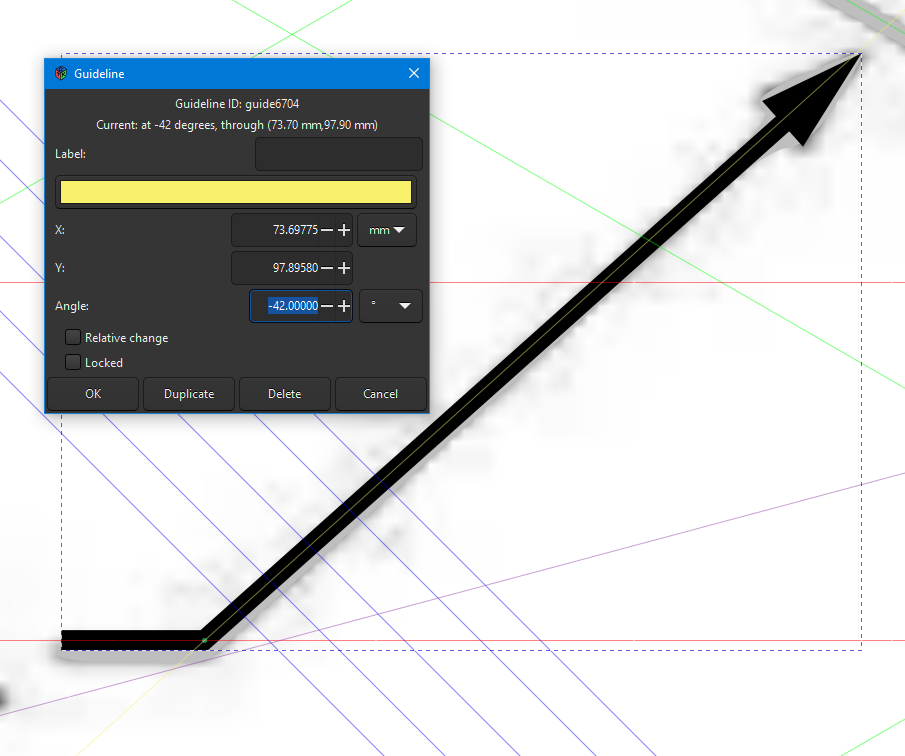
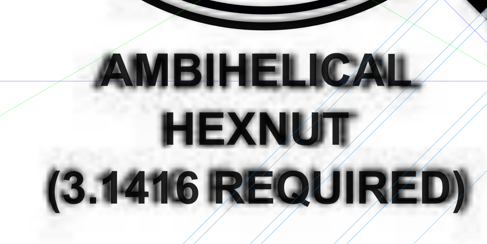
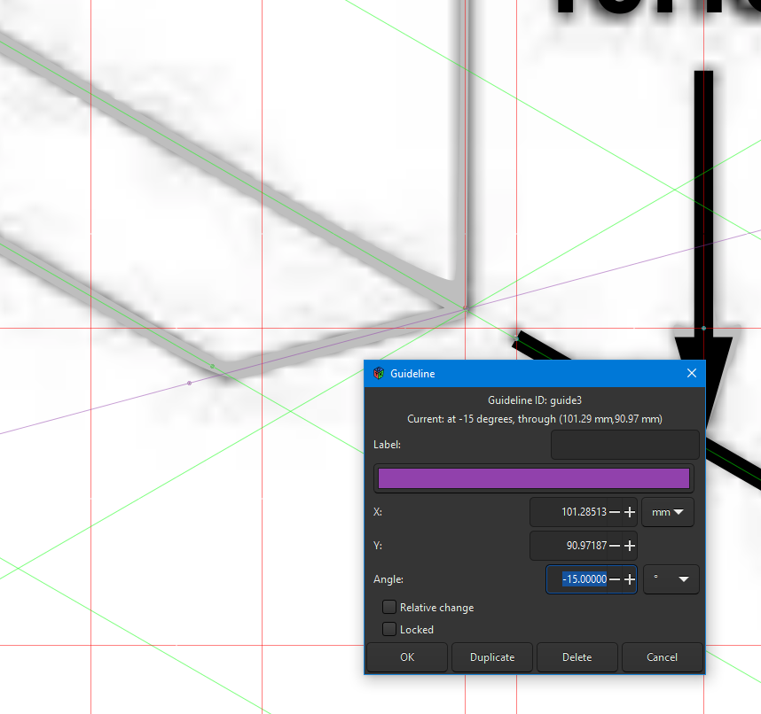

Found lo quality image all over the place, but searching for source or HQ versions wasn't forthcoming. It seems that it dates to before 2008.

It took quite a few guides:

Most guides followed ±30° or ±45°, but there were a few that were a bit off, I wasn't sure if I wanted to keep them or "fix" them:
1. The trichocotometric indicator support, but the arrow from the text 

1. actually, all the arrows

1. The font was simple to match, but the spacing was off by just a bit
1. The bottom corner didn't match any of the others, and wasn't symetric to the top. But exactly half the angle seemed oddly specific.